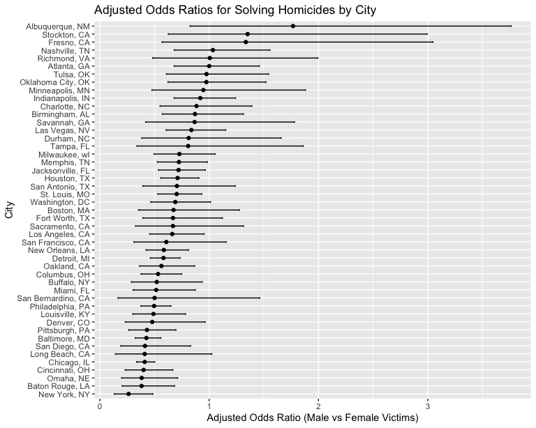

Homework 6
================
Yiying Wu

## 1

### Importing data

``` r
# import dataset
homicide <- read_csv("homicide-data.csv")
```

### Tidying and wrangling the data

``` r
homicide_clean <- homicide %>%
  mutate(city_state = paste(city, state, sep = ", ")) %>%
  filter(!(city_state %in% c("Dallas, TX", "Phoenix, AZ", "Kansas City, MO", "Tulsa, AL"))) %>%
  filter(victim_race %in% c("White", "Black")) %>%
  mutate(solved = if_else(disposition == "Closed by arrest", 1, 0)) %>%
  mutate(victim_age = as.numeric(victim_age))

# head(homicide_clean)
```

### Fit a logistic regression model for Baltimore, MD

``` r
baltimore_data <- homicide_clean %>%
                  filter(city_state == "Baltimore, MD")

# Fit logistic regression
model <- glm(solved ~ victim_age + victim_sex + victim_race, data = baltimore_data, family = "binomial")

# Use broom::tidy to obtain estimates and confidence intervals
broom::tidy(model) %>%knitr::kable(digits = 4)
```

| term             | estimate | std.error | statistic | p.value |
|:-----------------|---------:|----------:|----------:|--------:|
| (Intercept)      |   0.3100 |    0.1713 |    1.8096 |  0.0704 |
| victim_age       |  -0.0067 |    0.0033 |   -2.0241 |  0.0430 |
| victim_sexMale   |  -0.8545 |    0.1382 |   -6.1839 |  0.0000 |
| victim_raceWhite |   0.8418 |    0.1747 |    4.8179 |  0.0000 |

Calculate adjusted odds ratios and 95% CI

``` r
# Calculate adjusted odds ratios 
adjusted_or <- exp(coef(model)["victim_sexMale"])  # For Male vs Female comparison
CI <- confint(model)  # Default confidence interval
CI_adjusted_or <- exp(CI["victim_sexMale", ])

# Displaying the adjusted odds ratio and its confidence interval
adjusted_or
```

    ## victim_sexMale 
    ##      0.4255117

``` r
CI_adjusted_or
```

    ##     2.5 %    97.5 % 
    ## 0.3241908 0.5575508

The adjusted odds ratio of 0.426 indicates that in Baltimore, MD, the
likelihood of resolving a homicide case involving male victims is 42.6%
of that for female victims, after adjusting for additional variables.
This suggests a lower probability of solving cases with male victims
compared to female ones. The 95% confidence interval, ranging from 0.324
to 0.558, supports this finding and is statistically significant,
evidenced by the fact that it does not include 1.

### Run glm for each city and extract the odds ratio (OR) for male vs. female victims

``` r
# Fit models for each city and extract ORs
city_models <- homicide_clean %>%
               group_by(city_state) %>%
               nest() %>%
               mutate(model = map(data, ~glm(solved ~ victim_age + victim_sex + victim_race, data = .x, family = "binomial")),
                      tidied = map(model, broom::tidy,conf.int = TRUE))

# Unnest the data
city_or <- city_models %>%
           unnest(tidied) %>%
           filter(term == "victim_sexMale") %>%
            mutate(OR = exp(estimate),
                            CI_lower = exp(conf.low),
                            CI_upper = exp(conf.high))%>%
           select(city_state, term, OR, CI_lower, CI_upper)
city_or%>%knitr::kable(digits = 4)
```

| city_state         | term           |     OR | CI_lower | CI_upper |
|:-------------------|:---------------|-------:|---------:|---------:|
| Albuquerque, NM    | victim_sexMale | 1.7675 |   0.8247 |   3.7619 |
| Atlanta, GA        | victim_sexMale | 1.0001 |   0.6803 |   1.4583 |
| Baltimore, MD      | victim_sexMale | 0.4255 |   0.3242 |   0.5576 |
| Baton Rouge, LA    | victim_sexMale | 0.3814 |   0.2043 |   0.6836 |
| Birmingham, AL     | victim_sexMale | 0.8700 |   0.5714 |   1.3138 |
| Boston, MA         | victim_sexMale | 0.6740 |   0.3534 |   1.2768 |
| Buffalo, NY        | victim_sexMale | 0.5206 |   0.2884 |   0.9358 |
| Charlotte, NC      | victim_sexMale | 0.8839 |   0.5507 |   1.3906 |
| Chicago, IL        | victim_sexMale | 0.4101 |   0.3361 |   0.5009 |
| Cincinnati, OH     | victim_sexMale | 0.3998 |   0.2314 |   0.6670 |
| Columbus, OH       | victim_sexMale | 0.5325 |   0.3770 |   0.7479 |
| Denver, CO         | victim_sexMale | 0.4791 |   0.2327 |   0.9625 |
| Detroit, MI        | victim_sexMale | 0.5823 |   0.4619 |   0.7335 |
| Durham, NC         | victim_sexMale | 0.8124 |   0.3824 |   1.6580 |
| Fort Worth, TX     | victim_sexMale | 0.6690 |   0.3935 |   1.1212 |
| Fresno, CA         | victim_sexMale | 1.3352 |   0.5673 |   3.0475 |
| Houston, TX        | victim_sexMale | 0.7110 |   0.5570 |   0.9057 |
| Indianapolis, IN   | victim_sexMale | 0.9187 |   0.6785 |   1.2413 |
| Jacksonville, FL   | victim_sexMale | 0.7198 |   0.5359 |   0.9651 |
| Las Vegas, NV      | victim_sexMale | 0.8373 |   0.6059 |   1.1511 |
| Long Beach, CA     | victim_sexMale | 0.4102 |   0.1427 |   1.0242 |
| Los Angeles, CA    | victim_sexMale | 0.6619 |   0.4565 |   0.9541 |
| Louisville, KY     | victim_sexMale | 0.4906 |   0.3015 |   0.7836 |
| Memphis, TN        | victim_sexMale | 0.7232 |   0.5261 |   0.9836 |
| Miami, FL          | victim_sexMale | 0.5152 |   0.3040 |   0.8734 |
| Milwaukee, wI      | victim_sexMale | 0.7271 |   0.4951 |   1.0542 |
| Minneapolis, MN    | victim_sexMale | 0.9470 |   0.4759 |   1.8810 |
| Nashville, TN      | victim_sexMale | 1.0342 |   0.6807 |   1.5560 |
| New Orleans, LA    | victim_sexMale | 0.5849 |   0.4219 |   0.8122 |
| New York, NY       | victim_sexMale | 0.2624 |   0.1328 |   0.4850 |
| Oakland, CA        | victim_sexMale | 0.5631 |   0.3637 |   0.8671 |
| Oklahoma City, OK  | victim_sexMale | 0.9741 |   0.6229 |   1.5200 |
| Omaha, NE          | victim_sexMale | 0.3825 |   0.1988 |   0.7109 |
| Philadelphia, PA   | victim_sexMale | 0.4963 |   0.3760 |   0.6499 |
| Pittsburgh, PA     | victim_sexMale | 0.4308 |   0.2626 |   0.6956 |
| Richmond, VA       | victim_sexMale | 1.0061 |   0.4835 |   1.9936 |
| San Antonio, TX    | victim_sexMale | 0.7046 |   0.3928 |   1.2383 |
| Sacramento, CA     | victim_sexMale | 0.6688 |   0.3263 |   1.3144 |
| Savannah, GA       | victim_sexMale | 0.8670 |   0.4186 |   1.7802 |
| San Bernardino, CA | victim_sexMale | 0.5003 |   0.1655 |   1.4624 |
| San Diego, CA      | victim_sexMale | 0.4130 |   0.1914 |   0.8302 |
| San Francisco, CA  | victim_sexMale | 0.6075 |   0.3117 |   1.1551 |
| St. Louis, MO      | victim_sexMale | 0.7032 |   0.5299 |   0.9319 |
| Stockton, CA       | victim_sexMale | 1.3517 |   0.6256 |   2.9941 |
| Tampa, FL          | victim_sexMale | 0.8077 |   0.3395 |   1.8599 |
| Tulsa, OK          | victim_sexMale | 0.9758 |   0.6091 |   1.5439 |
| Washington, DC     | victim_sexMale | 0.6902 |   0.4654 |   1.0123 |

### Plotting

``` r
# Plotting
ggplot(city_or, aes(x = reorder(city_state, OR), y = OR)) +
  geom_point() +
  geom_errorbar(aes(ymin = CI_lower, ymax = CI_upper), width = 0.2) +
  coord_flip() +
  xlab("City") +
  ylab("Adjusted Odds Ratio (Male vs Female Victims)") +
  ggtitle("Adjusted Odds Ratios for Solving Homicides by City")
```


