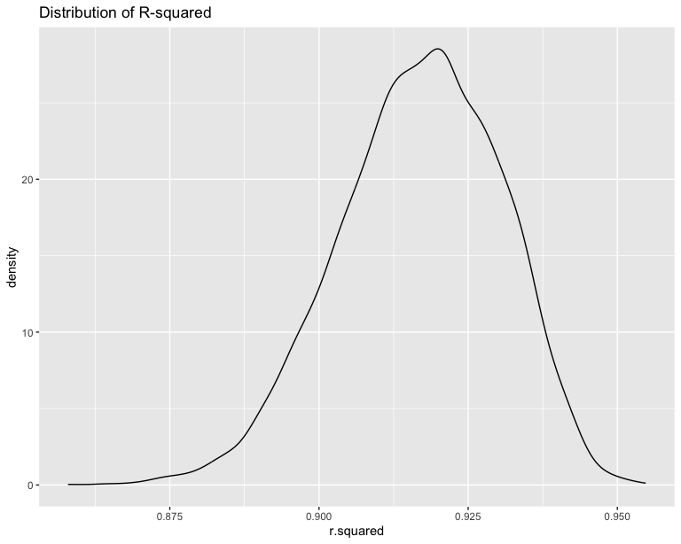

Homework 6
================
Yiying Wu

## 1

### Importing data

``` r
# import dataset
homicide <- read_csv("homicide-data.csv")
```

### Tidying and wrangling the data

``` r
homicide_clean <- homicide %>%
  mutate(city_state = paste(city, state, sep = ", ")) %>%
  filter(!(city_state %in% c("Dallas, TX", "Phoenix, AZ", "Kansas City, MO", "Tulsa, AL"))) %>%
  filter(victim_race %in% c("White", "Black")) %>%
  mutate(solved = if_else(disposition == "Closed by arrest", 1, 0)) %>%
  mutate(victim_age = as.numeric(victim_age))

# head(homicide_clean)
```

### Fit a logistic regression model for Baltimore, MD

``` r
baltimore_data <- homicide_clean %>%
                  filter(city_state == "Baltimore, MD")

# Fit logistic regression
model <- glm(solved ~ victim_age + victim_sex + victim_race, data = baltimore_data, family = "binomial")

# Use broom::tidy to obtain estimates and confidence intervals
broom::tidy(model) %>%knitr::kable(digits = 4)
```

| term             | estimate | std.error | statistic | p.value |
|:-----------------|---------:|----------:|----------:|--------:|
| (Intercept)      |   0.3100 |    0.1713 |    1.8096 |  0.0704 |
| victim_age       |  -0.0067 |    0.0033 |   -2.0241 |  0.0430 |
| victim_sexMale   |  -0.8545 |    0.1382 |   -6.1839 |  0.0000 |
| victim_raceWhite |   0.8418 |    0.1747 |    4.8179 |  0.0000 |

Calculate adjusted odds ratios and 95% CI

``` r
# Calculate adjusted odds ratios 
adjusted_or <- exp(coef(model)["victim_sexMale"])  # For Male vs Female comparison
CI <- confint(model)  # Default confidence interval
CI_adjusted_or <- exp(CI["victim_sexMale", ])

# Displaying the adjusted odds ratio and its confidence interval
adjusted_or
```

    ## victim_sexMale 
    ##      0.4255117

``` r
CI_adjusted_or
```

    ##     2.5 %    97.5 % 
    ## 0.3241908 0.5575508

The adjusted odds ratio of 0.426 indicates that in Baltimore, MD, the
likelihood of resolving a homicide case involving male victims is 42.6%
of that for female victims, after adjusting for additional variables.
This suggests a lower probability of solving cases with male victims
compared to female ones. The 95% confidence interval, ranging from 0.324
to 0.558, supports this finding and is statistically significant,
evidenced by the fact that it does not include 1.

### Run glm for each city and extract the odds ratio (OR) for male vs. female victims

``` r
# Fit models for each city and extract ORs
city_models <- homicide_clean %>%
               group_by(city_state) %>%
               nest() %>%
               mutate(model = map(data, ~glm(solved ~ victim_age + victim_sex + victim_race, data = .x, family = "binomial")),
                      tidied = map(model, broom::tidy,conf.int = TRUE))

# Unnest the data
city_or <- city_models %>%
           unnest(tidied) %>%
           filter(term == "victim_sexMale") %>%
            mutate(OR = exp(estimate),
                            CI_lower = exp(conf.low),
                            CI_upper = exp(conf.high))%>%
           select(city_state, term, OR, CI_lower, CI_upper)
city_or%>%knitr::kable(digits = 4)
```

| city_state         | term           |     OR | CI_lower | CI_upper |
|:-------------------|:---------------|-------:|---------:|---------:|
| Albuquerque, NM    | victim_sexMale | 1.7675 |   0.8247 |   3.7619 |
| Atlanta, GA        | victim_sexMale | 1.0001 |   0.6803 |   1.4583 |
| Baltimore, MD      | victim_sexMale | 0.4255 |   0.3242 |   0.5576 |
| Baton Rouge, LA    | victim_sexMale | 0.3814 |   0.2043 |   0.6836 |
| Birmingham, AL     | victim_sexMale | 0.8700 |   0.5714 |   1.3138 |
| Boston, MA         | victim_sexMale | 0.6740 |   0.3534 |   1.2768 |
| Buffalo, NY        | victim_sexMale | 0.5206 |   0.2884 |   0.9358 |
| Charlotte, NC      | victim_sexMale | 0.8839 |   0.5507 |   1.3906 |
| Chicago, IL        | victim_sexMale | 0.4101 |   0.3361 |   0.5009 |
| Cincinnati, OH     | victim_sexMale | 0.3998 |   0.2314 |   0.6670 |
| Columbus, OH       | victim_sexMale | 0.5325 |   0.3770 |   0.7479 |
| Denver, CO         | victim_sexMale | 0.4791 |   0.2327 |   0.9625 |
| Detroit, MI        | victim_sexMale | 0.5823 |   0.4619 |   0.7335 |
| Durham, NC         | victim_sexMale | 0.8124 |   0.3824 |   1.6580 |
| Fort Worth, TX     | victim_sexMale | 0.6690 |   0.3935 |   1.1212 |
| Fresno, CA         | victim_sexMale | 1.3352 |   0.5673 |   3.0475 |
| Houston, TX        | victim_sexMale | 0.7110 |   0.5570 |   0.9057 |
| Indianapolis, IN   | victim_sexMale | 0.9187 |   0.6785 |   1.2413 |
| Jacksonville, FL   | victim_sexMale | 0.7198 |   0.5359 |   0.9651 |
| Las Vegas, NV      | victim_sexMale | 0.8373 |   0.6059 |   1.1511 |
| Long Beach, CA     | victim_sexMale | 0.4102 |   0.1427 |   1.0242 |
| Los Angeles, CA    | victim_sexMale | 0.6619 |   0.4565 |   0.9541 |
| Louisville, KY     | victim_sexMale | 0.4906 |   0.3015 |   0.7836 |
| Memphis, TN        | victim_sexMale | 0.7232 |   0.5261 |   0.9836 |
| Miami, FL          | victim_sexMale | 0.5152 |   0.3040 |   0.8734 |
| Milwaukee, wI      | victim_sexMale | 0.7271 |   0.4951 |   1.0542 |
| Minneapolis, MN    | victim_sexMale | 0.9470 |   0.4759 |   1.8810 |
| Nashville, TN      | victim_sexMale | 1.0342 |   0.6807 |   1.5560 |
| New Orleans, LA    | victim_sexMale | 0.5849 |   0.4219 |   0.8122 |
| New York, NY       | victim_sexMale | 0.2624 |   0.1328 |   0.4850 |
| Oakland, CA        | victim_sexMale | 0.5631 |   0.3637 |   0.8671 |
| Oklahoma City, OK  | victim_sexMale | 0.9741 |   0.6229 |   1.5200 |
| Omaha, NE          | victim_sexMale | 0.3825 |   0.1988 |   0.7109 |
| Philadelphia, PA   | victim_sexMale | 0.4963 |   0.3760 |   0.6499 |
| Pittsburgh, PA     | victim_sexMale | 0.4308 |   0.2626 |   0.6956 |
| Richmond, VA       | victim_sexMale | 1.0061 |   0.4835 |   1.9936 |
| San Antonio, TX    | victim_sexMale | 0.7046 |   0.3928 |   1.2383 |
| Sacramento, CA     | victim_sexMale | 0.6688 |   0.3263 |   1.3144 |
| Savannah, GA       | victim_sexMale | 0.8670 |   0.4186 |   1.7802 |
| San Bernardino, CA | victim_sexMale | 0.5003 |   0.1655 |   1.4624 |
| San Diego, CA      | victim_sexMale | 0.4130 |   0.1914 |   0.8302 |
| San Francisco, CA  | victim_sexMale | 0.6075 |   0.3117 |   1.1551 |
| St. Louis, MO      | victim_sexMale | 0.7032 |   0.5299 |   0.9319 |
| Stockton, CA       | victim_sexMale | 1.3517 |   0.6256 |   2.9941 |
| Tampa, FL          | victim_sexMale | 0.8077 |   0.3395 |   1.8599 |
| Tulsa, OK          | victim_sexMale | 0.9758 |   0.6091 |   1.5439 |
| Washington, DC     | victim_sexMale | 0.6902 |   0.4654 |   1.0123 |

### Plotting

``` r
# Plotting
ggplot(city_or, aes(x = reorder(city_state, OR), y = OR)) +
  geom_point() +
  geom_errorbar(aes(ymin = CI_lower, ymax = CI_upper), width = 0.2) +
  coord_flip() +
  xlab("City") +
  ylab("Adjusted Odds Ratio (Male vs Female Victims)") +
  ggtitle("Adjusted Odds Ratios for Solving Homicides by City")
```


The plot displays the adjusted odds ratios (ORs) for solving homicides
by city, comparing male to female victims. It appears that most cities
have an OR less than 1, suggesting that homicides with male victims are
less likely to be solved than those with female victims when controlling
for other factors. This trend is consistent across various cities,
indicating a possible widespread pattern. Some cities have notably wider
confidence intervals, suggesting less precision in the estimate possibly
due to smaller sample sizes or greater variability in the data. The
cities are ranked by their estimated ORs, highlighting differences in
the likelihood of solving homicides involving male victims across
different urban areas.

## 2

### Download Central Park weather data

``` r
weather_df = 
  rnoaa::meteo_pull_monitors(
    c("USW00094728"),
    var = c("PRCP", "TMIN", "TMAX"), 
    date_min = "2022-01-01",
    date_max = "2022-12-31") |>
  mutate(
    name = recode(id, USW00094728 = "CentralPark_NY"),
    tmin = tmin / 10,
    tmax = tmax / 10) |>
  select(name, id, everything())
```

### Fitting a simple linear regression model

``` r
fit0 <- lm(tmax ~ tmin + prcp, data = weather_df)
```

### Bootstrap analysis for $\hat r^2$ and $\log(\hat\beta_1\times \hat\beta_2)$

``` r
set.seed(8105)

# Generating 5000 bootstraps of the dataset
boot_sample = function(df) {
  sample_frac(df, replace = TRUE)
}

boot_straps = 
  data_frame(
    strap_number = 1:5000,
    strap_sample = rerun(5000, boot_sample(weather_df))
  )

# Generating 5000 bootstrap estimates
bootstrap_results = 
  boot_straps %>% 
  mutate(
    models = map(strap_sample, ~lm(tmax ~ tmin + prcp, data = .x) ),
    results = map(models, broom::tidy)) %>% 
  select(-strap_sample, -models) %>% 
  unnest(results) 

# Computing log_betas and getting 5000 of those estiamtes
log_betas <-  
  bootstrap_results %>%
  group_by(strap_number) %>%
  summarise(log_betas = log(estimate[2] * estimate[3])) %>%
  select(log_betas, strap_number)

# Generating 5000 bootstrap estimates
bootstrap_results2 <- 
  boot_straps %>% 
  mutate(
    models = map(strap_sample, ~lm(tmax ~ tmin + prcp, data = .x) ),
    results = map(models, broom::glance)) %>% 
  select(-strap_sample, -models) %>% 
  unnest(results) 

# Getting 5000 R-Squared estimates
r_squared <- 
  bootstrap_results2 %>%
  select(r.squared, strap_number)
```

### Fitting density plots of two estimates

``` r
log_betas_sd <- 
  log_betas %>%
  summarise(log_betas_sd = sd(as.numeric(log_betas),na.rm = TRUE)) %>%
  pull(log_betas_sd)

log_betas_mean <- 
  log_betas %>% 
  summarise(log_betas_mean = mean(as.numeric(log_betas), na.rm = TRUE)) %>%
  pull(log_betas_mean)

log_betas %>%
  ggplot(aes(x = log_betas)) + geom_density() +
  labs(title = "Distribution of log(Beta1 * Beta2)")
```


The density curve for $\log(\hat\beta_1\times \hat\beta_2)$ is
left-skewed with a mean around -6.1149 and a sd around 1.2273

``` r
r_squared_sd <-
  r_squared %>%
  summarise(r_squared_sd = sd(r.squared)) %>%
  pull(r_squared_sd)

r_squared_mean <-
  r_squared %>%
  summarise(r_squared_mean = mean(r.squared)) %>%
  pull(r_squared_mean)

r_squared %>%
  ggplot(aes(x = r.squared)) + geom_density()+
  labs(title = "Distribution of R-squared")
```



The density curve for $\hat r^2$ is slightly left-skewed with a mean
around 0.9168 and a sd around 0.0136

### 95% CI for $\log(\hat\beta_1\times \hat\beta_2)$

``` r
CI_result <-
  log_betas %>%
  summarize(ci_lower = quantile(log_betas, 0.025, na.rm = TRUE),
            ci_upper = quantile(log_betas, 0.975, na.rm = TRUE))

CI_result_lower <- CI_result %>% pull(ci_lower)
CI_result_upper <- CI_result %>% pull(ci_upper)
```

95% Confidence Interval of $\log(\hat\beta_1\times \hat\beta_2)$ is
between (-9.1341,-4.5757)

### 95% CI for $\hat r^2$

``` r
CI_result2 <-
  r_squared %>%
  summarize(ci_lower = quantile(r.squared, 0.025),
            ci_upper = quantile(r.squared, 0.975)) 

CI_result_lower2 <- CI_result2 %>% pull(ci_lower)
CI_result_upper2 <- CI_result2 %>% pull(ci_upper)
```

95% Confidence Interval of $\hat r^2$ is between (0.889,0.9406)

## 3

### Importing data

``` r
birthweight <- read_csv("birthweight.csv")
```

### Tidying and wrangling the data

``` r
cleaned_birthweight <-
  birthweight %>% 
  janitor::clean_names() %>%
  mutate(across(.cols = c(babysex, frace, malform, mrace), as.factor)) %>%
  mutate(babysex = ifelse(babysex == "1", "male","female"),
         malform = ifelse(malform == "0", "absent","present"),
         frace = recode(frace, "1" = "White", "2" = "Black", "3" = "Asian", 
                        "4" = "Puerto Rican", "8" = "Other", "9" = "Unknown"),
         mrace = recode(mrace, "1" = "White", "2" = "Black", 
                        "3" = "Asian", "4" = "Puerto Rican", "8" = "Other")
         )
```

Changed categorical variables: babysex, frace, malform, and mrace into
factors and recoded numerical values of these categorical variables to
their associated information.

### Checking Missing Values

``` r
skimr::skim(cleaned_birthweight)
```

|                                                  |                     |
|:-------------------------------------------------|:--------------------|
| Name                                             | cleaned_birthweight |
| Number of rows                                   | 4342                |
| Number of columns                                | 20                  |
| \_\_\_\_\_\_\_\_\_\_\_\_\_\_\_\_\_\_\_\_\_\_\_   |                     |
| Column type frequency:                           |                     |
| character                                        | 2                   |
| factor                                           | 2                   |
| numeric                                          | 16                  |
| \_\_\_\_\_\_\_\_\_\_\_\_\_\_\_\_\_\_\_\_\_\_\_\_ |                     |
| Group variables                                  | None                |

Data summary

**Variable type: character**

| skim_variable | n_missing | complete_rate | min | max | empty | n_unique | whitespace |
|:--------------|----------:|--------------:|----:|----:|------:|---------:|-----------:|
| babysex       |         0 |             1 |   4 |   6 |     0 |        2 |          0 |
| malform       |         0 |             1 |   6 |   7 |     0 |        2 |          0 |

**Variable type: factor**

| skim_variable | n_missing | complete_rate | ordered | n_unique | top_counts                              |
|:--------------|----------:|--------------:|:--------|---------:|:----------------------------------------|
| frace         |         0 |             1 | FALSE   |        5 | Whi: 2123, Bla: 1911, Pue: 248, Asi: 46 |
| mrace         |         0 |             1 | FALSE   |        4 | Whi: 2147, Bla: 1909, Pue: 243, Asi: 43 |

**Variable type: numeric**

| skim_variable | n_missing | complete_rate |    mean |     sd |     p0 |     p25 |     p50 |     p75 |   p100 | hist  |
|:--------------|----------:|--------------:|--------:|-------:|-------:|--------:|--------:|--------:|-------:|:------|
| bhead         |         0 |             1 |   33.65 |   1.62 |  21.00 |   33.00 |   34.00 |   35.00 |   41.0 | ▁▁▆▇▁ |
| blength       |         0 |             1 |   49.75 |   2.72 |  20.00 |   48.00 |   50.00 |   51.00 |   63.0 | ▁▁▁▇▁ |
| bwt           |         0 |             1 | 3114.40 | 512.15 | 595.00 | 2807.00 | 3132.50 | 3459.00 | 4791.0 | ▁▁▇▇▁ |
| delwt         |         0 |             1 |  145.57 |  22.21 |  86.00 |  131.00 |  143.00 |  157.00 |  334.0 | ▅▇▁▁▁ |
| fincome       |         0 |             1 |   44.11 |  25.98 |   0.00 |   25.00 |   35.00 |   65.00 |   96.0 | ▃▇▅▂▃ |
| gaweeks       |         0 |             1 |   39.43 |   3.15 |  17.70 |   38.30 |   39.90 |   41.10 |   51.3 | ▁▁▂▇▁ |
| menarche      |         0 |             1 |   12.51 |   1.48 |   0.00 |   12.00 |   12.00 |   13.00 |   19.0 | ▁▁▂▇▁ |
| mheight       |         0 |             1 |   63.49 |   2.66 |  48.00 |   62.00 |   63.00 |   65.00 |   77.0 | ▁▁▇▂▁ |
| momage        |         0 |             1 |   20.30 |   3.88 |  12.00 |   18.00 |   20.00 |   22.00 |   44.0 | ▅▇▂▁▁ |
| parity        |         0 |             1 |    0.00 |   0.10 |   0.00 |    0.00 |    0.00 |    0.00 |    6.0 | ▇▁▁▁▁ |
| pnumlbw       |         0 |             1 |    0.00 |   0.00 |   0.00 |    0.00 |    0.00 |    0.00 |    0.0 | ▁▁▇▁▁ |
| pnumsga       |         0 |             1 |    0.00 |   0.00 |   0.00 |    0.00 |    0.00 |    0.00 |    0.0 | ▁▁▇▁▁ |
| ppbmi         |         0 |             1 |   21.57 |   3.18 |  13.07 |   19.53 |   21.03 |   22.91 |   46.1 | ▃▇▁▁▁ |
| ppwt          |         0 |             1 |  123.49 |  20.16 |  70.00 |  110.00 |  120.00 |  134.00 |  287.0 | ▅▇▁▁▁ |
| smoken        |         0 |             1 |    4.15 |   7.41 |   0.00 |    0.00 |    0.00 |    5.00 |   60.0 | ▇▁▁▁▁ |
| wtgain        |         0 |             1 |   22.08 |  10.94 | -46.00 |   15.00 |   22.00 |   28.00 |   89.0 | ▁▁▇▁▁ |

There is no missing data. The dimension of the birthweight data is 4342
x 20. The 20 variables include: babysex, bhead, blength, bwt, delwt,
fincome, frace, gaweeks, malform, menarche, mheight, momage, mrace,
parity, pnumlbw, pnumsga, ppbmi, ppwt, smoken, wtgain.

### Fit the full model

``` r
full_model <- lm(bwt ~ ., data = cleaned_birthweight)
summary(full_model)
```

    ## 
    ## Call:
    ## lm(formula = bwt ~ ., data = cleaned_birthweight)
    ## 
    ## Residuals:
    ##      Min       1Q   Median       3Q      Max 
    ## -1097.68  -184.86    -3.33   173.09  2344.15 
    ## 
    ## Coefficients: (3 not defined because of singularities)
    ##                     Estimate Std. Error t value Pr(>|t|)    
    ## (Intercept)       -6236.6841   660.1884  -9.447  < 2e-16 ***
    ## babysexmale         -28.7073     8.4652  -3.391 0.000702 ***
    ## bhead               130.7781     3.4523  37.881  < 2e-16 ***
    ## blength              74.9536     2.0217  37.075  < 2e-16 ***
    ## delwt                 4.1007     0.3948  10.386  < 2e-16 ***
    ## fincome               0.2898     0.1795   1.614 0.106551    
    ## fraceBlack           14.3313    46.1501   0.311 0.756168    
    ## fraceAsian           21.2361    69.2960   0.306 0.759273    
    ## fracePuerto Rican   -46.9962    44.6782  -1.052 0.292912    
    ## fraceOther            4.2969    74.0741   0.058 0.953745    
    ## gaweeks              11.5494     1.4654   7.882 4.06e-15 ***
    ## malformpresent        9.7650    70.6259   0.138 0.890039    
    ## menarche             -3.5508     2.8951  -1.226 0.220083    
    ## mheight               9.7874    10.3116   0.949 0.342588    
    ## momage                0.7593     1.2221   0.621 0.534418    
    ## mraceBlack         -151.4354    46.0453  -3.289 0.001014 ** 
    ## mraceAsian          -91.3866    71.9190  -1.271 0.203908    
    ## mracePuerto Rican   -56.4787    45.1369  -1.251 0.210901    
    ## parity               95.5411    40.4793   2.360 0.018307 *  
    ## pnumlbw                   NA         NA      NA       NA    
    ## pnumsga                   NA         NA      NA       NA    
    ## ppbmi                 4.3538    14.8913   0.292 0.770017    
    ## ppwt                 -3.4716     2.6121  -1.329 0.183913    
    ## smoken               -4.8544     0.5871  -8.269  < 2e-16 ***
    ## wtgain                    NA         NA      NA       NA    
    ## ---
    ## Signif. codes:  0 '***' 0.001 '**' 0.01 '*' 0.05 '.' 0.1 ' ' 1
    ## 
    ## Residual standard error: 272.5 on 4320 degrees of freedom
    ## Multiple R-squared:  0.7183, Adjusted R-squared:  0.717 
    ## F-statistic: 524.6 on 21 and 4320 DF,  p-value: < 2.2e-16

The coefficients for babysex, bhead, blength, delwt, gaweeks, mrace,
parity, and smoken are significant at the 0.05 level. The NAs for
pnumlbw, pnumsga, and wtgain suggest that there are issues with these
variables in the model, such as multicollinearity.
